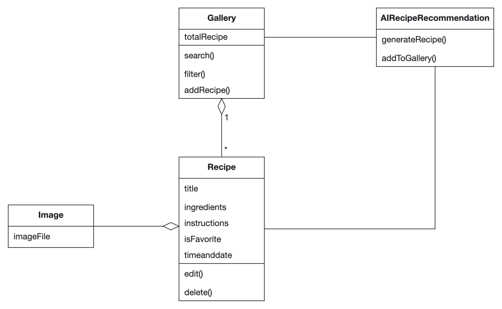

# Intro Course Project App of Christian Devin for the iPraktikum

To pass the intro course, you need to create your own unique iOS app (based on SwiftUI).

There are no requirements regarding the functions of your app, so you can get creative.
However, we provide you with Non-Functional Requirements (NFR) that your app needs to fulfill.

After each day of learning new Swift and SwiftUI concepts, these NFRs may change, or new NFRs get added.

## Submission procedure

You get a **personal repository** on Gitlab to work on your app.

Once you implemented a new feature into your app, you need to create a Merge Request (MR - Sometimes we will also reference these as "Pull Requests"(PR)) to merge your changes from the feature branch into your main branch.

Your tutor will review your changes and either request changes or approves the MR.

If your MR got approved, you also need to merge it!

### Deadline: **15.10.2024 23:59**

Until the deadline all of your PRs **need to be merged** and your final app **needs to fulfill** all of the requested NFRs!

---

## Problem Statement (max. 500 words)

As a home cook, I often find it challenging to keep my collection of recipes organized and accessible. With many sources of inspiration, I struggle to manage my favorite recipes, often forgetting where I saved them or how to quickly find what I want to cook based on the ingredients I have on hand. This disorganization can lead to wasted ingredients.

To address this issue, I need an iOS application that allows me to efficiently manage my recipes. The app should enable me to add, edit, and delete recipes, as well as view them in a gallery format for quick browsing. The app should also allow me to filter recipes by recently added recipes, favorites, or cooking time, and include a simple search function to quickly find recipes based on keywords. Additionally, it should incorporate an AI feature that generates recipe suggestions based on the ingredients I currently have at home, helping me minimize waste. Overall, the app should provide a user-friendly experience that keeps my recipes organized and easily accessible.
## Requirements

I want to be able to…

- … add a new recipe with details such as title, ingredients, image and instructions.
- … edit existing recipes to update title, ingredients, instructions and image as needed.
- … delete recipes that I no longer want to keep.
- … view my recipes in a gallery format.
- … filter recipes by recently added recipes, or favorites.
- … search for recipes using keywords related to ingredients or titles.
- … bookmark favorite recipes for easy access.
- … generate recipe suggestions based on the ingredients I have at home using AI. (optional)

## Analysis

## System Design

## Product Backlog

| id | name | priority |
| ------ | ------ | ------ |
|   1   | Add new recipe | Major |
|   2   | Edit existing recipe | Minor |
|   3   | Delete existing recipe | Minor |
|   4   | View recipes in gallery | Major |
|   5   | Filter recipes | Minor |
|   6   | Search for recipe | Major |
|   7   | Bookmark favorite recipe | Minor |
|   8   | Generate Recipe suggestions | Minor (optional) |